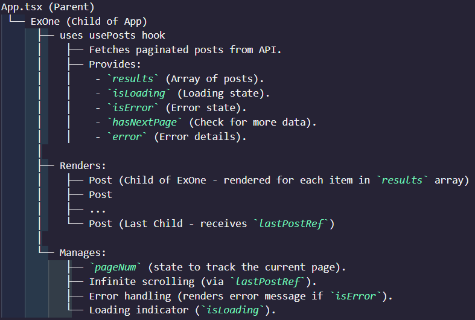

# Infinite scroll with React, Axios, and TypeScript

This project demonstrates how to fetch paginated posts from an API endpoint using `axios` in a React app with TypeScript. It includes functionality for managing loading state, error handling, and cleanup using `AbortController`.




-   The parent (ExOne) needs to know when the fetched set of posts (results) has the last post, for that we use ref which will get attached to the last post, we track that by using the length and index comparison

## Key Features

-   **Axios Integration**: Fetch data from `https://jsonplaceholder.typicode.com` using an Axios instance. Is leveraged by the usePosts hook
-   **Pagination Support**: Load one page of results at a time from the API.
-   **AbortController for Cleanup**: Cancel the request when the component unmounts.
-   **TypeScript Integration**: The project includes TypeScript for improved type safety, defining a `Post` type and prop types for consistent API response handling.
-   **Error Handling**: A dedicated `error` object is used to capture and display any errors during the fetch process.
-   **Efficient State Management**: Manage multiple states, including:
    -   `results` for fetched posts.
    -   `isLoading` for tracking the loading status.
    -   `isError` for tracking errors during fetch.
    -   `hasNextPage` for determining if more results are available.
-   **Custom Hook**: The `usePosts` hook encapsulates reusable fetching logic and state management for components.

## Insights

1. **UseEffect Dependency Array**:
    - The dependency array for `useEffect` can include not only state variables but also props or any other values from the component scope that the effect depends on.
2. **Abort Signal with Axios**:
    - Passing an `AbortController` signal to Axios ensures that promises are canceled when they are no longer needed, avoiding memory leaks.
3. **Error Handling with Axios**:

    - Capturing errors using `.catch` and managing the `error` state allows the app to gracefully handle API failures.

4. **State Management Best Practices**

    - React hooks promote managing state close to where it is most relevant. Since usePosts is responsible for fetching posts, it naturally makes sense for it to own the related state (isError, isLoading, etc.).
    - This avoids "prop drilling" or managing unrelated state in the parent component, which can lead to tightly coupled and harder-to-maintain code.

# ForwardRef and Typing in React with TypeScript

## ForwardRef Overview

`ForwardRef` is a React utility function that allows a parent component to pass `ref` values to a child functional component. This is particularly useful when the parent component needs direct access to the child component's DOM. In infinite scrolling, the parent component tracks whether the child post component is at the last index to initiate another API call for fetching more posts.

### Monitoring the Last Post with Ref

By attaching a `ref` (e.g., `lastPostRef`) to the last post, you gain direct access to the DOM element of that post. This allows you to monitor its position or visibility on the screen, which is essential for implementing features like infinite scrolling.

---

## Learning Through Errors

### Why Do We Need to Type the Prop and Ref?

1. **Prop Typing (for Post Component)**:
    - **Reason**: To ensure that the `Post` component receives the exact data structure it expects. This prevents runtime errors and makes the component reusable and robust.
    - **Issue**: Without typing, TypeScript treats the props as an empty object (`{}` by default), leading to the following problems:
        - TypeScript doesn't recognize the structure of the props.
        - TypeScript doesn’t know what kind of element the `ref` points to.

---

## Key Errors and Fixes

### 1. Ref Handling in the Post Component

-   **Issue**: The `Post` component doesn't explicitly define the type for `ref`. While the `ref` is forwarded, its type is incompatible with React's expected types.
-   **Fix**:
    -   Use `React.forwardRef` with a properly defined type for the `ref`.
    -   Explicitly define the `Post` props to include the post object.

### 2. Type Errors for Post Props

-   **Issue**: The `Post` component expects a `post` prop, but TypeScript type checking doesn't recognize it because the type is missing.
-   **Fix**: Define the `post` prop type explicitly.

### 3. `useRef` Type Incompatibility

-   **Issue**: `useRef` is initialized without specifying the type, which defaults to `undefined`. This causes a mismatch when React tries to assign it to the DOM element.
-   **Fix**: Specify the type for `useRef` during initialization.

### 4. UseEffect being triggered on saving the code in ExOne file resulting in adding duplicate posts in the components.

-   **Fix**: Filter duplicates out, only fresh posts get addded to the state, use of `some`: This method checks if at least one element in the array passes the test implemented by the provided function. It returns true if such an element is found, and false otherwise.

```
const newPosts = data.filter(post => !prev.some(exists => exists.id === post.id));
return [...prev, ...newPosts];
```

-   The prev state variable, often named prevState or simply prev, represents the previous state value at the time the update is enqueued. When you use the functional form of setState, React passes the previous state as an argument to your update function

# Intersection Observer API usage (2 approaches):

My component needs to be responsible for displaying a list of posts and automatically loading more posts when the user scrolls to the bottom of the list. It uses the IntersectionObserver API to detect when the last post comes into view, and then it triggers the fetching of the next page of posts.

pageNum keeps track of the current page of posts being loaded.
When the user scrolls to the bottom, setPageNum increments the page number, which fetches the next set of posts.

## Approach 1


1. useRef is used to hold a mutable reference to the last post element.
2. It allows you to attach the same reference (lastPostRef.current) to a DOM element and manipulate it (observe/unobserve) without re-rendering the component.

3. The Intersection Observer logic is applied inside the useEffect hook, which observes the lastPostRef.current.

4. new IntersectionObserver creates an observer that monitors the visibility of the target element (lastPostRef.current)

5. The callback ((entries) => { ... }) is triggered whenever the target’s visibility changes.

    - entries[0].isIntersecting: A boolean that indicates if the target is visible in the viewport.
    - If it’s visible (isIntersecting === true) and hasNextPage is true, we trigger the setPageNum function to fetch the next page of data.

### Approach 2

1. useRef for the Intersection Observer

    intObserver is a mutable ref that holds the instance of the IntersectionObserver.
    Unlike the first approach where the observer is recreated every render, here it is reused across renders, which can improve performance.

2. Next is attaching the observer to the last post in the results

3. If data is already being fetched, I avoid setting up the observer again.

4. Before attaching the observer to a new last post, the old one is disconnected to prevent duplicate observations.

5. hasNextPage and Its Changes

    Origin: Returned by the usePosts hook.
    Logic: Determined based on the API response.
    If the API returns more posts, hasNextPage remains true.
    If no further posts are available, it changes to false.

